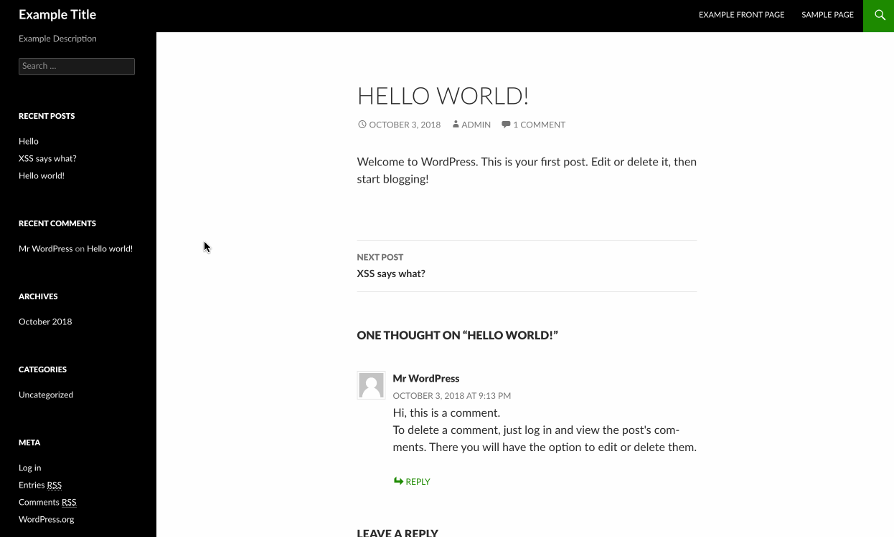

# Project 7 - WordPress Pentesting

Time spent: **5** hours spent in total

> Objective: Find, analyze, recreate, and document **three to five vulnerabilities** affecting an old version of WordPress

## Pentesting Report

1. Authenticated Stored Cross-Site Scripting (8111)
  - [ ] Summary: A user can create posts containing malicious code, which could execute when loaded. This is especially damaging to blogs allowing unauthenicated or unpriviledged users to create posts.
    - Vulnerability types: XSS
    - Tested in version: 4.2
    - Fixed in version: 4.2.3
  - [ ] GIF Walkthrough: 
    
  - [ ] Steps to recreate: 
    - Create and publish **text** post (instead of visual) containing ""
    - Reload page
  - [ ] Affected source code:
    - [Adding things like "'do_not_allow';" for "empty" posts](https://core.trac.wordpress.org/changeset/33357)
    
    
2.  Customizer XSS & CSRF 8820
  - [ ] Summary: Create an invisible div that evaluates Javascript; could easy do it **without** alerting the user.
    - Vulnerability types: XSS & CSRF
    - Tested in version: 4.2
    - Fixed in version: 4.2.15
  - [ ] GIF Walkthrough: 
      
  - [ ] Steps to recreate: 
     - Edit theme template by adding a div and putting in Javascript/other exploit.
  - [ ] Affected source code:
    - [AJAX function added to prevent injection](https://github.com/WordPress/WordPress/commit/3d10fef22d788f29aed745b0f5ff6f6baea69af3)
3. Vulnerability Name or ID
  - [ ] Summary: 
    - Vulnerability types:
    - Tested in version:
    - Fixed in version: 
  - [ ] GIF Walkthrough: 
  - [ ] Steps to recreate: 
  - [ ] Affected source code:
    - [Link 1](https://core.trac.wordpress.org/browser/tags/version/src/source_file.php)

## Assets

- [wpscan](https://wpscan.org/)
- [WPDistillery](https://wpdistillery.org/)
- [Vagrant](https://www.vagrantup.com/)

## Resources

- [WordPress Source Browser](https://core.trac.wordpress.org/browser/)
- [WordPress Developer Reference](https://developer.wordpress.org/reference/)
- GIFs created with [LiceCap](http://www.cockos.com/licecap/).

## Notes

Describe any challenges encountered while doing the work

## License

    Copyright 2018

    Licensed under the Apache License, Version 2.0 (the "License");
    you may not use this file except in compliance with the License.
    You may obtain a copy of the License at

        http://www.apache.org/licenses/LICENSE-2.0

    Unless required by applicable law or agreed to in writing, software
    distributed under the License is distributed on an "AS IS" BASIS,
    WITHOUT WARRANTIES OR CONDITIONS OF ANY KIND, either express or implied.
    See the License for the specific language governing permissions and
    limitations under the License.
